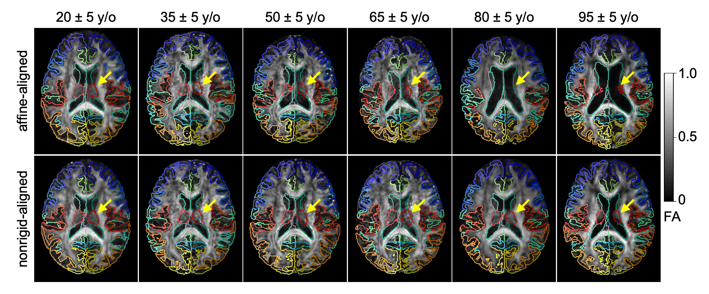
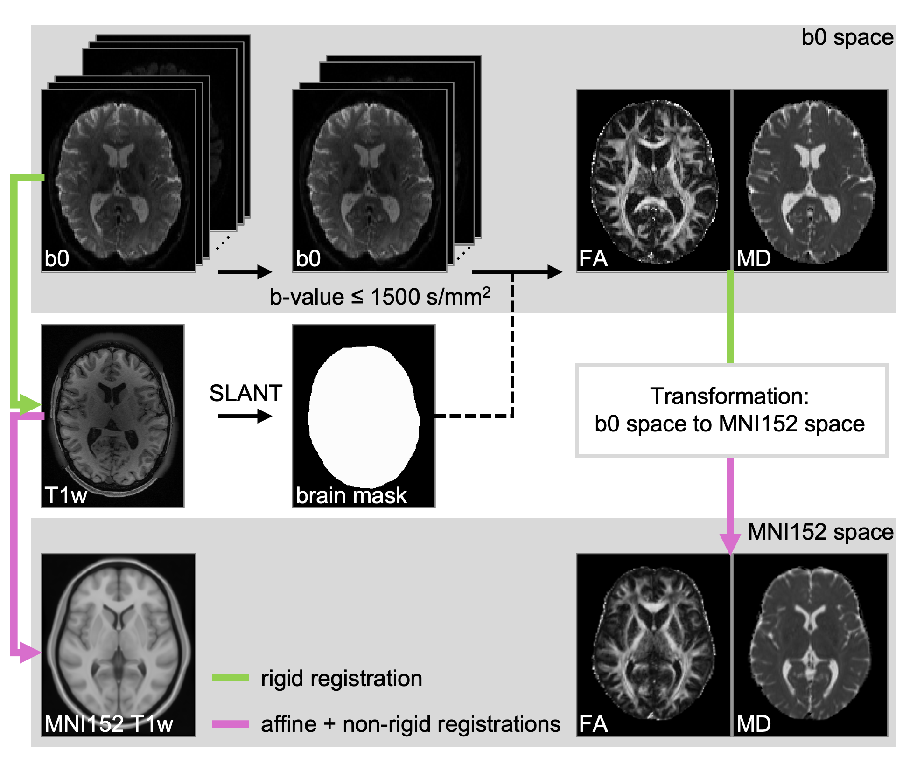

#  BRAID: Brain Age Identification from Diffusion MRI


<div align="center">
    
</div>

<div align="center">
    
</div>

- Publications:
    - [Gao et al. "Brain age identification from diffusion MRI synergistically predicts neurodegenerative disease." *arXiv* (2024)](https://arxiv.org/abs/2410.22454)
    - [Gao et al. "Predicting age from white matter diffusivity with residual learning." *Medical Imaging 2024: Image Processing.* (2024)](https://www.spiedigitallibrary.org/conference-proceedings-of-spie/12926/129262I/Predicting-age-from-white-matter-diffusivity-with-residual-learning/10.1117/12.3006525.full)

- Citation:
    ```bibtex
    @misc{gao2024brainageidentificationdiffusion,
        title={Brain age identification from diffusion MRI synergistically predicts neurodegenerative disease}, 
        author={Chenyu Gao and Michael E. Kim and Karthik Ramadass and Praitayini Kanakaraj and Aravind R. Krishnan and Adam M. Saunders and Nancy R. Newlin and Ho Hin Lee and Qi Yang and Warren D. Taylor and Brian D. Boyd and Lori L. Beason-Held and Susan M. Resnick and Lisa L. Barnes and David A. Bennett and Katherine D. Van Schaik and Derek B. Archer and Timothy J. Hohman and Angela L. Jefferson and Ivana Išgum and Daniel Moyer and Yuankai Huo and Kurt G. Schilling and Lianrui Zuo and Shunxing Bao and Nazirah Mohd Khairi and Zhiyuan Li and Christos Davatzikos and Bennett A. Landman},
        year={2024},
        eprint={2410.22454},
        archivePrefix={arXiv},
        primaryClass={cs.CV},
        url={https://arxiv.org/abs/2410.22454}, 
    }

    @inproceedings{10.1117/12.3006525,
        title = {{Predicting age from white matter diffusivity with residual learning}},
        author = {Chenyu Gao and Michael E. Kim and Ho Hin Lee and Qi Yang and Nazirah Mohd Khairi and Praitayini Kanakaraj and Nancy R. Newlin and Derek B. Archer and Angela L. Jefferson and Warren D. Taylor and Brian D. Boyd and Lori L. Beason-Held and Susan M. Resnick and Yuankai Huo and Katherine D. Van Schaik and Kurt G. Schilling and Daniel Moyer and Ivana Išgum and Bennett A. Landman},
        volume = {12926},
        booktitle = {Medical Imaging 2024: Image Processing},
        editor = {Olivier Colliot and Jhimli Mitra},
        organization = {International Society for Optics and Photonics},
        publisher = {SPIE},
        pages = {129262I},
        keywords = {brain age, diffusion tensor imaging, deep learning, convolutional neural networks},
        year = {2024},
        doi = {10.1117/12.3006525},
        URL = {https://doi.org/10.1117/12.3006525}
    }
    ```

