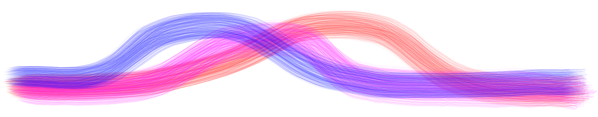

<p align="center">
    
</p>

# BRAID: Brain Age Identification from Diffusion MRI

Shield: [![CC BY-NC 4.0][cc-by-nc-shield]][cc-by-nc]

This work is licensed under a
[Creative Commons Attribution-NonCommercial 4.0 International License][cc-by-nc].

[![CC BY-NC 4.0][cc-by-nc-image]][cc-by-nc]

[cc-by-nc]: https://creativecommons.org/licenses/by-nc/4.0/
[cc-by-nc-image]: https://licensebuttons.net/l/by-nc/4.0/88x31.png
[cc-by-nc-shield]: https://img.shields.io/badge/License-CC%20BY--NC%204.0-lightgrey.svg

BRAID predicts brain age from diffusion MRI. Unlike its counterparts, which typically use anatomical features (volume, shape, etc.) to assist in the prediction, BRAID deliberately destroys anatomical information through non-rigid transformations. By minimizing anatomical information, BRAID can better focus on subtle microstructural changes that predate apparent anatomical changes in neurodegeneration. The goal of BRAID is not to be a perfect chronological age predictor, but to provide an earlier biomarker for neurodegenerative disease prediction.

<div align="center">
    
</div>

Illustration of the preprocessing, which minimizes anatomical information through non-rigid transformations.

<div align="center">
    
</div>

- Publications:
    - [Gao et al. "Brain age identification from diffusion MRI synergistically predicts neurodegenerative disease." *arXiv* (2024)](https://arxiv.org/abs/2410.22454)
    - [Gao et al. "Predicting age from white matter diffusivity with residual learning." *Medical Imaging 2024: Image Processing.* (2024)](https://www.spiedigitallibrary.org/conference-proceedings-of-spie/12926/129262I/Predicting-age-from-white-matter-diffusivity-with-residual-learning/10.1117/12.3006525.full)

- Citation:
    ```bibtex
    @misc{gao2024brainageidentificationdiffusion,
        title={Brain age identification from diffusion MRI synergistically predicts neurodegenerative disease}, 
        author={Chenyu Gao and Michael E. Kim and Karthik Ramadass and Praitayini Kanakaraj and Aravind R. Krishnan and Adam M. Saunders and Nancy R. Newlin and Ho Hin Lee and Qi Yang and Warren D. Taylor and Brian D. Boyd and Lori L. Beason-Held and Susan M. Resnick and Lisa L. Barnes and David A. Bennett and Katherine D. Van Schaik and Derek B. Archer and Timothy J. Hohman and Angela L. Jefferson and Ivana Išgum and Daniel Moyer and Yuankai Huo and Kurt G. Schilling and Lianrui Zuo and Shunxing Bao and Nazirah Mohd Khairi and Zhiyuan Li and Christos Davatzikos and Bennett A. Landman},
        year={2024},
        eprint={2410.22454},
        archivePrefix={arXiv},
        primaryClass={cs.CV},
        url={https://arxiv.org/abs/2410.22454}, 
    }

    @inproceedings{10.1117/12.3006525,
        title = {{Predicting age from white matter diffusivity with residual learning}},
        author = {Chenyu Gao and Michael E. Kim and Ho Hin Lee and Qi Yang and Nazirah Mohd Khairi and Praitayini Kanakaraj and Nancy R. Newlin and Derek B. Archer and Angela L. Jefferson and Warren D. Taylor and Brian D. Boyd and Lori L. Beason-Held and Susan M. Resnick and Yuankai Huo and Katherine D. Van Schaik and Kurt G. Schilling and Daniel Moyer and Ivana Išgum and Bennett A. Landman},
        volume = {12926},
        booktitle = {Medical Imaging 2024: Image Processing},
        editor = {Olivier Colliot and Jhimli Mitra},
        organization = {International Society for Optics and Photonics},
        publisher = {SPIE},
        pages = {129262I},
        keywords = {brain age, diffusion tensor imaging, deep learning, convolutional neural networks},
        year = {2024},
        doi = {10.1117/12.3006525},
        URL = {https://doi.org/10.1117/12.3006525}
    }
    ```

## Using the code:
*The documentation of this section and the refinement of corresponding scripts are still in-progress. Some "run it with one command" features might not work as promised. Please submit issues if you encounter such cases.*

### 1. Installation and pretrained weights
#### 1.1 Clone the repository
```bash
git clone https://github.com/MASILab/BRAID.git
```
#### 1.2 Create a virtual environment (optional, recommended)

Install python 
> Note: This package was developed using Python 3.11.5. For the best experience and minimal setup, Python 3.11 or later is recommended.

```bash
cd BRAID
python -m venv env
source env/bin/activate
```

#### 1.3 Install dependencies
```bash
pip install ./
```